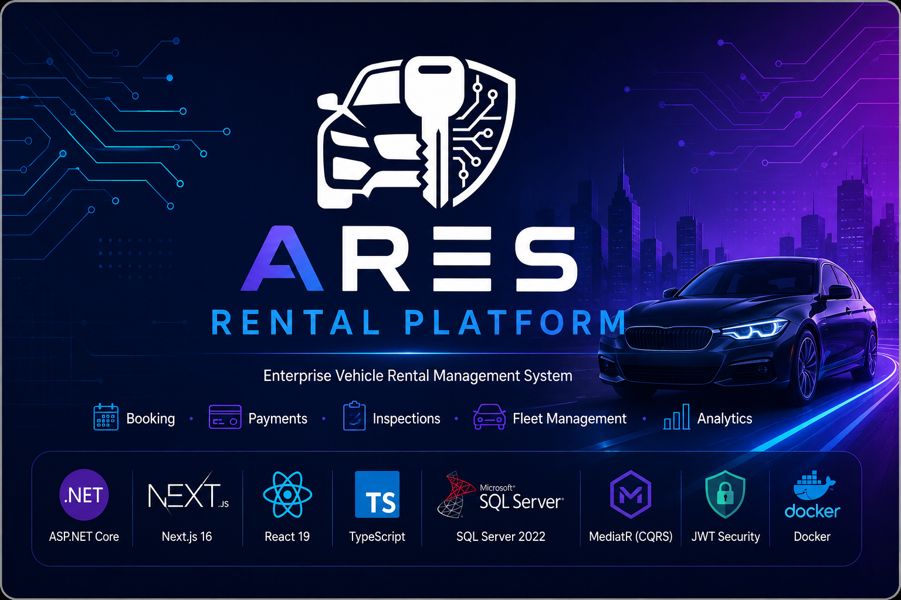
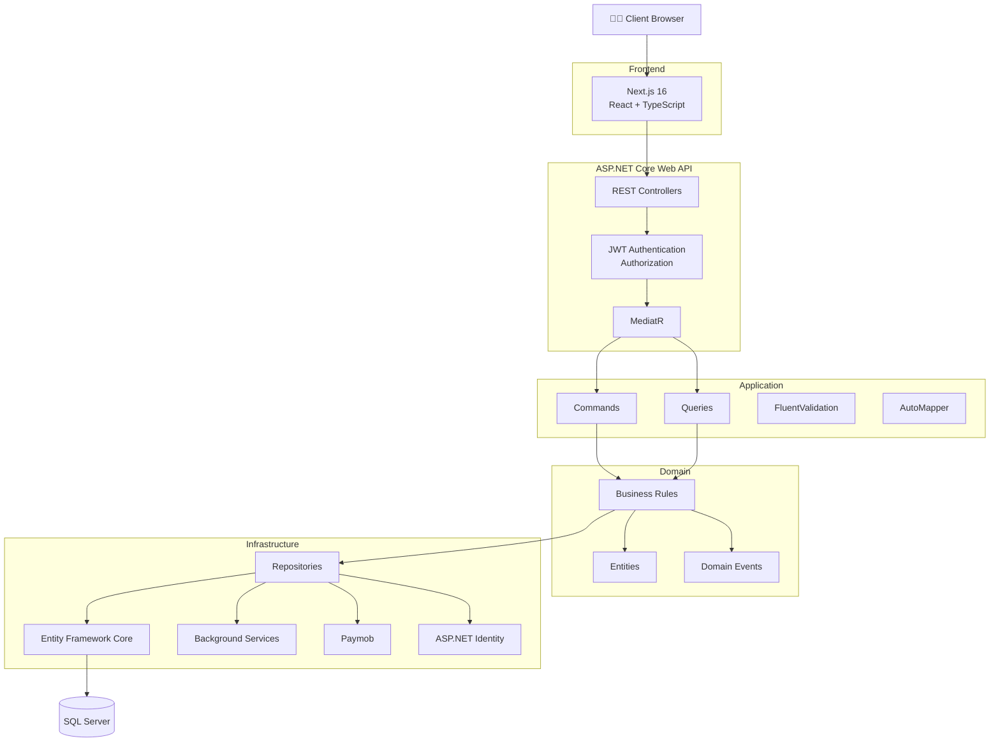
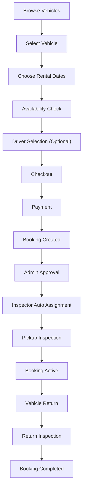
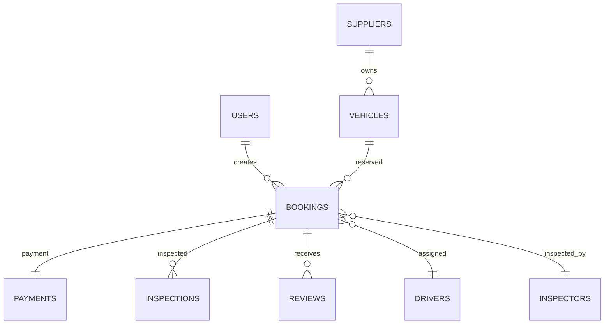

<p align="center">
  
</p>

<h1 align="center">ARES Rental Platform</h1>

<p align="center">
A modern enterprise-grade vehicle rental platform built with <strong>ASP.NET Core</strong>, <strong>Next.js</strong>, <strong>Clean Architecture</strong>, and <strong>SQL Server</strong>.
</p>

<p align="center">
Supporting the complete vehicle rental lifecycle from vehicle listing and booking to inspections, payments, fleet management, and analytics through a secure multi-role architecture.
</p>

<p align="center">


</p>

<p align="center">
  
</p>

## 📑 Table of Contents

- [About ARES](#-about-ares)
- [Key Features](#-key-features)
- [System Roles](#-system-roles)
- [System Architecture](#-system-architecture)
- [Booking Workflow](#-booking-workflow)
- [Technology Stack](#-technology-stack)
- [Project Structure](#-project-structure)
- [Quick Start](#-quick-start)
- [Manual Installation](#-manual-installation)
- [API Documentation](#-api-documentation)
- [Testing](#-testing)
- [Database Design](#-database-design)
- [Roadmap](#-roadmap)
- [Contributors](#-contributors)

# 📖 About ARES

ARES Rental Platform is a modern enterprise-grade vehicle rental management system developed as a graduation project at Al-Azhar University.

The platform connects customers, suppliers, drivers, inspectors, and administrators through a unified ecosystem that manages the complete vehicle rental lifecycle.

Built with **ASP.NET Core**, **Next.js**, **SQL Server**, and **Clean Architecture**, ARES delivers a scalable solution for vehicle booking, payment processing, inspections, fleet management, and administrative operations through secure role-based dashboards.

The project follows modern software engineering practices including **Clean Architecture**, **CQRS**, **MediatR**, **Repository Pattern**, **JWT Authentication**, **Background Services**, and **Internationalization**, making it suitable as a production-oriented software architecture.

## 📊 Project Highlights

| Feature | Description |
|----------|-------------|
| 👥 User Roles | 5 Integrated Roles |
| 🚗 Vehicle Management | Complete Fleet Lifecycle |
| 📅 Booking Workflow | End-to-End Reservation Process |
| 💳 Payment Gateway | Paymob Integration |
| 🔍 Vehicle Inspection | Pickup & Return Inspections |
| 🔔 Notifications | Real-time Notification System |
| 🌍 Localization | Arabic & English (RTL Support) |
| 🏗 Architecture | Clean Architecture + CQRS |
| 🔐 Authentication | JWT + Google OAuth |
| 📊 Dashboards | Role-based Analytics |

# ✨ Key Features

### 🚗 Vehicle Rental Management
- Complete vehicle lifecycle management from listing to booking and return.
- Advanced availability tracking and fleet management.
- Vehicle verification and approval workflow.
- Dynamic pricing and category management.

### 📅 Booking & Reservation
- End-to-end booking workflow.
- Secure checkout experience.
- Driver assignment support.
- Booking approval and cancellation management.
- Automatic booking expiration.

### 🔍 Inspection Management
- Pickup and return inspections.
- Automatic inspector assignment.
- Damage reporting and condition tracking.
- Fuel level and mileage recording.

### 💳 Payment Processing
- Paymob payment gateway integration.
- Secure payment verification.
- Refund management.
- Transaction history.

### 👥 Multi-Role Platform
- Customer Portal
- Supplier Dashboard
- Driver Dashboard
- Inspector Dashboard
- Administrator Dashboard

### 📊 Analytics & Administration
- Role-based dashboards.
- Financial reports.
- Booking analytics.
- Vehicle performance metrics.
- User management.

### 🔒 Security
- JWT Authentication.
- Google OAuth Login.
- Role-Based Authorization.
- Email Verification.
- Refresh Tokens.
- Rate Limiting.

### 🌍 Modern User Experience
- Responsive design.
- Arabic & English localization.
- RTL support.
- Dark & Light themes.

# 👥 System Roles

ARES is built around a **multi-role architecture**, where each role has dedicated permissions, dashboards, and business workflows.

| Role | Responsibilities |
|------|-------------------|
| 👤 **Customer** | Browse vehicles, create bookings, complete payments, manage reservations, submit reviews, and track booking status. |
| 🚘 **Supplier** | Register and manage vehicles, monitor bookings, review earnings, respond to customer requests, and manage fleet operations. |
| 🚖 **Driver** | Complete driver profile, manage availability, receive assignments, track trips, and request payouts. |
| 🔍 **Inspector** | Perform pickup and return inspections, record vehicle condition, report damages, verify mileage, and submit inspection reports. |
| 🛠 **Administrator** | Manage users, vehicles, bookings, inspections, payments, suppliers, drivers, reports, and overall platform operations. |

---

### 🔐 Role-Based Access Control

Each role accesses its own dedicated dashboard with customized features and permissions.

| Dashboard | Access |
|-----------|--------|
| Customer Portal | Customer |
| Supplier Dashboard | Supplier |
| Driver Dashboard | Driver |
| Inspector Dashboard | Inspector |
| Admin Dashboard | Administrator |

# 🏗️ System Architecture



## 🎯 Design Principles

| Principle | Purpose |
|------------|---------|
| **Clean Architecture** | Separates business logic from infrastructure to improve maintainability and scalability. |
| **CQRS** | Separates read and write operations for better organization and performance. |
| **Repository Pattern** | Abstracts data access from business logic. |
| **Dependency Injection** | Promotes loose coupling and testability. |
| **SOLID Principles** | Improves code quality, maintainability, and extensibility. |
| **Background Services** | Automates scheduled tasks such as inspector assignment and booking expiration. |
| **Role-Based Authorization** | Restricts access based on user roles and permissions. |
| **RESTful API Design** | Provides consistent and standardized API endpoints. |

# 🚀 Booking Workflow


## 📌 Booking States

| Status | Description |
|---------|-------------|
| 🟡 **Draft** | Initial booking created before payment. |
| 💳 **Payment Pending** | Waiting for successful payment confirmation. |
| 🟢 **Confirmed** | Payment completed and booking confirmed. |
| ✅ **Approved** | Booking approved by the administrator. |
| 🚗 **Active** | Vehicle has been delivered to the customer. |
| 🏁 **Completed** | Rental completed successfully after return inspection. |
| ❌ **Cancelled** | Booking cancelled by the customer or administrator. |
| ⏰ **Expired** | Booking automatically expired due to payment timeout. |
---
## 🤖 Automated Business Processes

ARES automates several critical business operations to reduce manual effort and improve operational efficiency.

- ✅ Automatic vehicle availability validation.
- ✅ Dynamic rental price calculation.
- ✅ Automatic inspector assignment based on region and workload.
- ✅ Automatic booking expiration after payment timeout.
- ✅ Real-time notifications throughout the booking lifecycle.
- ✅ Vehicle status synchronization.
- ✅ Refund calculation according to the cancellation policy.
---

# 🗄 Database Design

ARES uses a normalized relational database designed to efficiently support the complete vehicle rental lifecycle.


## Core Database Entities

| Entity | Responsibility |
|---------|----------------|
| Users | Authentication and user management. |
| Vehicles | Fleet management and availability. |
| Bookings | Reservation lifecycle management. |
| Payments | Payment transactions and verification. |
| Inspections | Pickup and return inspection reports. |
| Reviews | Customer feedback and ratings. |
| Suppliers | Vehicle ownership and fleet operations. |
| Drivers | Driver assignment and trip management. |

> **Note:** The complete Entity Relationship Diagram (ERD) is available below.

<p align="center">
    
</p>

# 🛠 Technology Stack

| Category | Technologies |
|----------|--------------|
| Backend | ASP.NET Core 10, C#, MediatR, CQRS, FluentValidation |
| Frontend | Next.js 16, React 19, TypeScript, Tailwind CSS |
| Database | SQL Server, Entity Framework Core |
| Authentication | ASP.NET Identity, JWT, Google OAuth |
| Payments | Paymob |
| Architecture | Clean Architecture, Repository Pattern |
| DevOps | Docker, Git, GitHub |
| Documentation | Swagger (OpenAPI), Mermaid |

# 📂 Project Structure

```text
ARES-Rental-Platform
│
├── Backend
│   ├── API
│   ├── Application
│   ├── Domain
│   ├── Infrastructure
│   └── Shared
│
├── Frontend
│   ├── app
│   ├── components
│   ├── lib
│   └── shared
│
├── docs
│
└── docker
```
# 🚀 Quick Start

Get ARES up and running in just a few minutes.

## Prerequisites

Before getting started, make sure you have the following installed:

| Requirement | Version |
|------------|---------|
| .NET SDK | 10.0 or later |
| Bun | 1.0 or later |
| SQL Server | 2022 |
| Node.js *(Optional)* | 18+ |
| ngrok *(Optional, for Paymob Webhooks)* | Latest |

## Quick Setup

```bash
# Install project dependencies
bun run deps

# Interactive project setup
bun run setup

# Quick setup with default values
bun run setup:quick
```

> **Tip:** The setup script automatically installs the required .NET tools (`dotnet-ef` and `dotnet-script`) if they are not already available.

# ⚙️ Manual Installation

## 1. Start SQL Server

```bash
docker run -e "ACCEPT_EULA=Y" \
-e "SA_PASSWORD=YourStrong@Passw0rd" \
-p 1433:1433 \
--name mssql \
-d mcr.microsoft.com/mssql/server:2022-latest
```

---

## 2. Configure & Run the Backend

```bash
cd backend

cp .env.example .env

dotnet restore

cd Api

dotnet ef database update

dotnet run
```

The backend will be available at:

- **API:** http://localhost:5000
- **Swagger UI:** http://localhost:5000/swagger

---

## 3. Configure & Run the Frontend

```bash
cd frontend

cp .env.example .env.local

bun install

bun run dev
```

The frontend will be available at:

- **Web App:** http://localhost:3000

---

## 4. Configure Paymob (Optional)

ARES supports **Paymob** for online payment processing.

To enable payment integration:

- Create a Paymob Sandbox account.
- Obtain your **API Key**, **HMAC Secret**, **Integration ID**, and **iFrame ID**.
- Configure them in the backend `.env` file.
- Expose your local backend using **ngrok** when testing webhooks locally.

> **Note:** Paymob configuration is optional. The platform can run normally without enabling online payments.

# 📖 API Documentation

ARES exposes a RESTful API documented with **Swagger (OpenAPI)**.

**Swagger UI:** http://localhost:5000/swagger

## API Modules

| Module | Base Path | Purpose |
|---------|-----------|---------|
| 🌐 Public | `/api/public/*` | Public content, health checks, promotions, and offers. |
| 🔐 Authentication | `/api/auth/*` | Registration, login, Google OAuth, JWT, and refresh tokens. |
| 👤 Customer | `/api/vehicles/*`, `/api/checkout`, `/api/bookings/*` | Vehicle browsing, checkout, and booking management. |
| 🚘 Supplier | `/api/supplier/*` | Fleet management, bookings, earnings, and reviews. |
| 🚖 Driver | `/api/driver/*` | Driver profile, license verification, earnings, and payouts. |
| 🔍 Inspector | `/api/inspector/*` | Inspection dashboard and vehicle inspections. |
| 🛠 Administrator | `/api/admin/*` | Platform administration, users, bookings, vehicles, categories, inspections, and reports. |
| 🔄 Shared Services | `/api/notifications/*`, `/api/payments/*` | Notifications, payment processing, and shared platform services. |

---

## API Highlights

- JWT Authentication & Role-Based Authorization
- Google OAuth Authentication
- RESTful API Design
- OpenAPI (Swagger) Documentation
- FluentValidation Request Validation
- Standardized Error Responses
- Global Exception Handling
- Rate Limiting Protection

---

## Health Checks

| Service | Endpoint |
|---------|----------|
| Backend API | `GET /api/health` |
| Frontend | `GET /api/health` |


